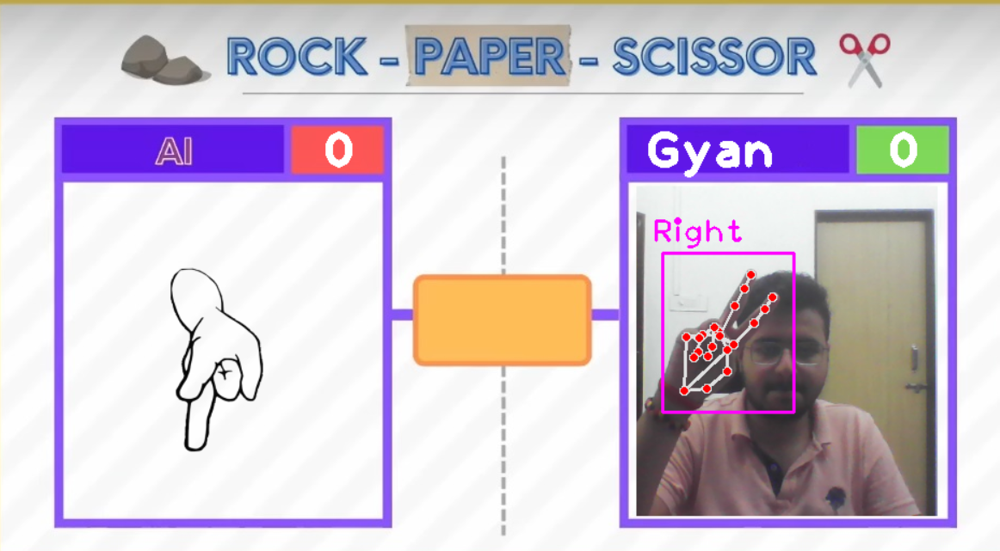
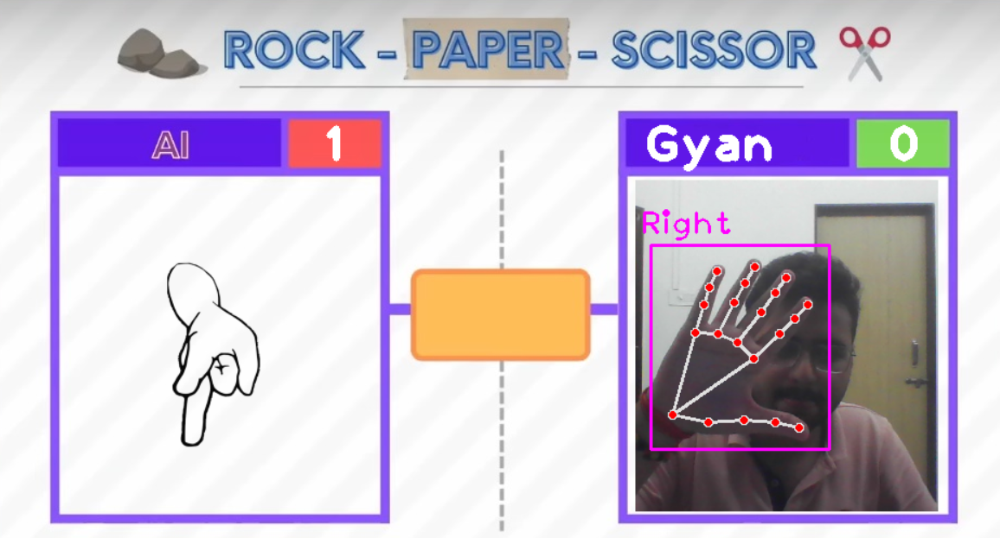

# Rock-Paper-Scissors with Computer Vision

This Python project implements a Rock-Paper-Scissors game where the computer detects your hand gesture (rock, paper, scissors) using OpenCV and determines the winner. It unlocks the game by detecting your face.

**Features:**

- Interactive game with computer vision-based hand gesture recognition
- Utilizes OpenCV, NumPy, Face-Recognition, and CV-Zone libraries

**Installation:**

1. Clone this repository.
2. Make virtual ev
2. Install the required libraries.
4. Create photos folder in main directory and store your photos with name
5. Update the name in unlock folder

**Usage:**
1. Run the script:
   python rock_paper_scissors.py
2. Follow the on-screen instructions to play the game.
3. Hold your hand up to the webcam and display the desired gesture (rock, paper, scissors).
4. The computer will detect your gesture and determine the winner (you or the computer).

**Screeshots**

